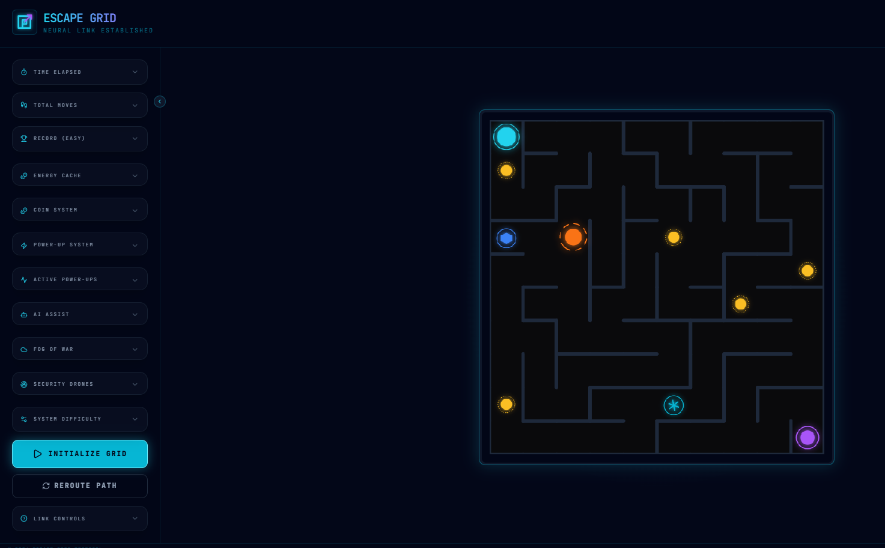

# 🎮 ESCAPE GRID

<p align="center">
  
</p>

<p align="center">
  
  
  
  
  
</p>

---

> **"Escape the maze. Outsmart intelligent drones. Collect energy cores. Survive the cybernetic labyrinth."**

**Escape Grid** is a premium, production-quality cyberpunk maze game. It combines procedural generation with strategic gameplay, intelligent AI opponents, and a polished futuristic aesthetic. Navigate high-density grids, manage power-ups, and optimize your path to reach the exit node before synchronization is lost.

---

## 🚀 Key Features

- ✅ **Procedural Maze Generation**: Every grid is unique, generated using recursive backtracking with multi-path loop insertion.
- ✅ **Dynamic Difficulty**: Three tiered modes (**Easy, Medium, Hard**) with scaling grid sizes and enemy complexity.
- ✅ **Intelligent Enemy AI**: Three distinct drone types (**Scout, Hunter, Sentinel**) with unique tracking and hunting behaviors.
- ✅ **Energy Cache System**: Optional collectible energy cores with score tracking and persistent high-scores.
- ✅ **Combat Support (Power-Ups)**: Strategically deploy **Shields**, **Freeze Drones**, and **Speed Boosts**.
- ✅ **Neural Guidance (AI Assist)**: Request path hints or full-route visualizations via advanced BFS pathfinding.
- ✅ **Fog of War**: Immersive exploration mode with memory-based visibility (available in Easy/Medium).
- ✅ **Responsive Interface**: Optimized for both Desktop and Mobile navigation.
- ✅ **Cyberpunk UI**: Glassmorphic panels, neon glow effects, and smooth animated transitions.

---


## 🛠 Tech Stack

| Technology | Purpose |
| :--- | :--- |
| **React** | Component-based UI architecture |
| **TypeScript** | Type-safe game logic and state management |
| **HTML5 Canvas** | High-performance maze and entity rendering |
| **Tailwind CSS** | Premium glassmorphic styling and responsive layout |
| **Vite** | Lightning-fast development and build pipeline |
| **Lucide React** | Cybernetic iconography |
| **Local Storage** | Persistence for records, settings, and UI states |

---

## 🎮 Controls

Navigate the grid using your preferred input method:

| Key | Action |
| :--- | :--- |
| **W / ↑** | Move Up |
| **A / ←** | Move Left |
| **S / ↓** | Move Down |
| **D / →** | Move Right |
| **Touch** | Mobile directional controls |

---

## 📊 Difficulty Comparison

| Tier | Grid Size | Enemies | Energy Cores | Power-Ups | Fog of War |
| :--- | :---: | :---: | :---: | :---: | :--- |
| **Easy** | 10 × 10 | 1 | 5 | 2 | Supported |
| **Medium** | 20 × 20 | 2 | 8 | 3 | Supported |
| **Hard** | 28 × 28 | 3 | 12 | 4 | Restricted |

---

## 🧠 Advanced Systems

<details>
<summary>🤖 Intelligent Drone AI</summary>
The grid is patrolled by various security drones:
- **Scout**: Follows random patrol routes with backtracking prevention.
- **Sentinel**: Actively tracks your position when you enter its proximity.
- **Hunter**: Uses BFS shortest-path algorithms to intercept you directly.
</details>

<details>
<summary>⚡ Tactical Power-Ups</summary>
Enhance your survival odds with optional combat support:
- **🛡 Shield**: Absorbs a single drone collision.
- **❄ Freeze**: Pauses all drone movement for 3 seconds.
- **⚡ Speed**: Reduces movement latency for 5 seconds.
</details>

<details>
<summary>🌫 Fog of War & Memory</summary>
Enable stealth protocols to limit visibility to a 4-cell radius. The system maintains an "Exploration Memory," keeping previously visited areas dimmed while unexplored sectors remain in total darkness.
</details>

---

## 🏗 Installation & Setup

### Prerequisites
- Node.js (v18 or higher)
- npm or bun

### Local Development
```bash
# Clone the repository
git clone <repository-url>

# Enter directory
cd escape-grid

# Install dependencies
npm install

# Launch development server
npm run dev
```

### Production Build
```bash
# Generate optimized assets
npm run build

# Preview build locally
npm run preview
```

---

## 📂 Project Structure

```text
escape-grid/
├── src/
│   ├── components/  # Cyberpunk UI modules (Sidebar, Cards, Modals)
│   ├── game/        # Core logic (Maze Gen, AI, Pathfinding, Logic)
│   ├── hooks/       # State management and input handlers
│   ├── utils/       # Persistent storage and helper functions
│   └── styles/      # Global theme and animations
├── assets/          # Brand and marketing assets
└── public/          # Favicon and static files
```

---


---

## 📄 License

Distributed under the **MIT License**. See `LICENSE` for more information.

---

<p align="center">
  <b>Built with ❤️ for puzzle lovers, gamers, and developers who enjoy procedural generation.</b>
</p>
